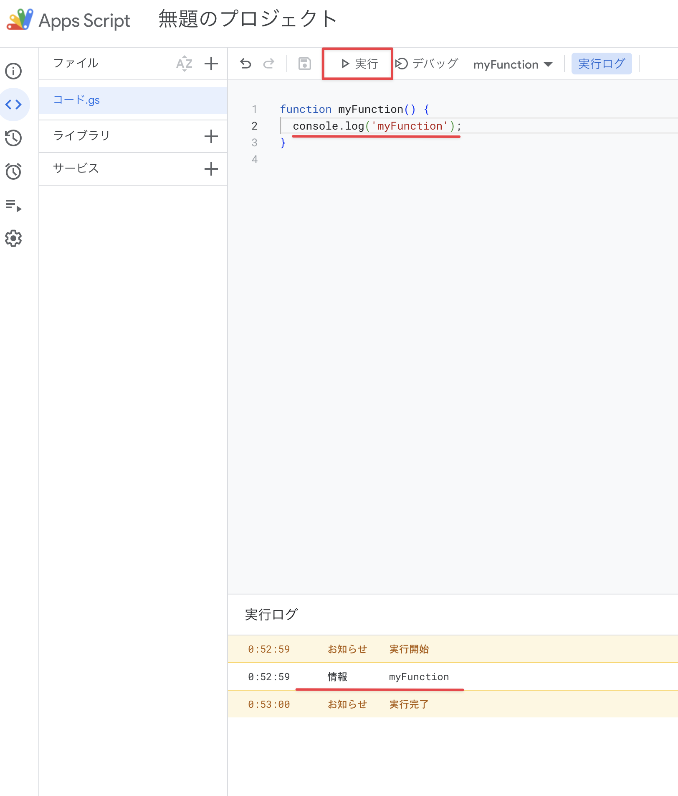

# [Google Apps Script](https://www.google.com/script/start/)

スプレッドシートやスライドの操作やその他Webアプリケーションや定期実行のプログラム実行環境として使用できるJavaScriptの実行環境。  
基本的にはコンソール上のエディタを使用してプログラムを記述する。

[@google/clasp](https://github.com/google/clasp) を使用することで、TypeScript を使用してプログラムを書くことも可能。

#### 利用例

##### 週次ミーティングの資料のバックアップ

スクリプト  
https://script.google.com/u/1/home/projects/1M-eczW6yWmGfsY_7ndWqN6nMmHpXAGnJXwjWGsbrnfWR1rbhEY0oA6cv/edit

##### URLからQRコードの画像を複数枚発行する

スプレッドシート  
https://docs.google.com/spreadsheets/d/1YJKHreGig3oTGb5o_wGBntrlR7BUk97xWfZklX7Jhq0/edit?gid=0#gid=0

スクリプト  
https://script.google.com/u/1/home/projects/1mHJ4VQVjrg4sqHV7k3lNEa7RYX_ZgILlfzxry6N20jZkhmy0Wkg5APoG/edit

##### AppStore のレビューをクロールしてSlackに送信する

スクリプト  
https://script.google.com/u/1/home/projects/1KzxmU9RAAqptoZ4HcreKQr78DE-wZ07E9VlhOvDfNqhrCkAOEGksGQQ1/edit

#### Apps Scriptを使う理由

エンジニアが使用するならプログラミングをしてメールの自動送信ツールを作るのも良い。
スプレッドシート（やExcel）の入力方法はその他の入力方法とは全くの別物で、エンジニア以外でもとても効率的にデータを作成することができるツール。
そのため業務の効率化など

SQLを書かなくてもデータの抽出ができるし、ReDash 用意してあればCSVでダウンロードして好きなようにデータを加工して調査が行える


## コンソール上からプログラムを実装する

### 1. プロジェクトを作成する

1. https://www.google.com/script/start/ にアクセス
2. 画面右上の「Start Scripting」をクリックする
3. 画面左上「新しいプロジェクト」をクリックする

### 2. プログラムを書いてみる

```javascript
function myFunction() {
    console.log('myFunction');
}
```

### 3. 実行する

上部のツールバーの「実行」をクリックする。  
実行ログに「myFunction」が表示されることが確認できる。



## メールの下書き一括作成ツールを作成する

### 1. スプレッドシートを新しく作る

[Google ドライブ](https://drive.google.com/drive/home) にアクセスして「新規」から「Googleスプレッドシート」を作成する

### 2. Apps Script を繋ぎこむ

1. 「拡張機能 > Apps Script をクリック
2. Apps Script のページが開く
3. サイドメニューの詳細を見てスプレッドシートに紐づいていることが確認で来る

あとからスプレッドシートに紐つけることも、何にも紐付けないで複数のスプレッドシートにアクセスすることも可能。

### 3. 下書き

## 外部APIを利用してみる

```Bash
curl "https://www.googleapis.com/pagespeedonline/v5/runPagespeed?url=https://www.sukima.me"
```

## TypeScrip を使用して、Apps Script を作成する

## Google Apps 以外のサービスを使用する